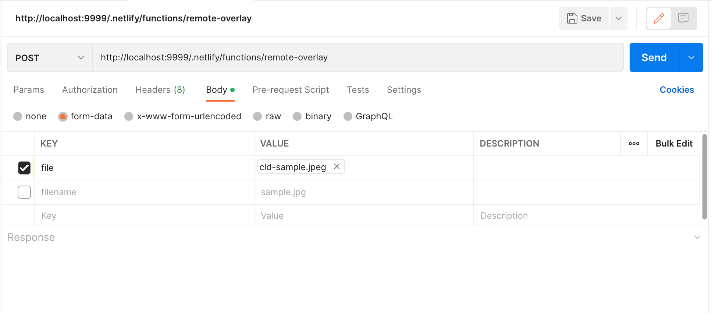

# Implement a Lambda Function to Serve as a Cloudinary Remote function.

This function call be called via Cloudinary URL as a remote function. The remote function provides a custom transformation.  

In this example, the transformation is a text overlay showing the time the transformation was called and the derived iamge cached.  

You can create a signed function (backend only) that calls a remote function to add a custom transformation. In this example 
we add the date cached as an image overlay. This is a derived image that will get cached as it is delivered to the requesting user.  


## Netlify Function

The code is implemented and served as a Netlify function here: 

You can test locally, by installing the Netlify CLI and starting a local server:

```zsh
netlify functions:serve
```
### Test with Postman

Then go to Postman and test by setting the following options.  Note that the `file` key is a file type that you choose from your local file system.



### Test with cURL


```bash
curl --location --request POST 'https://shiny-cld-remote.netlify.app/.netlify/functions/remote-overlay' \
--form 'file=@"./sample.png"'
```

## Create a Remote URL

Add your Cloudinary account credentials - CLOUDINARY_URL=.... - to a .env file. Add your public id to `indexs.js`.
Execute index.js to produce a signed URL that will access the remote function.

```JavaScript
const url = cloudinary.url('<PUBLIC ID>', {
  sign_url: true,
  transformation: [
    {
      custom_function: {
        function_type: 'remote',
        source: 'https://shiny-cld-remote.netlify.app/.netlify/functions/remote-overlay'
      }
    },
    { border: '15px_solid_coral' }
  ]
})
```

```zsh
node index.js
```
